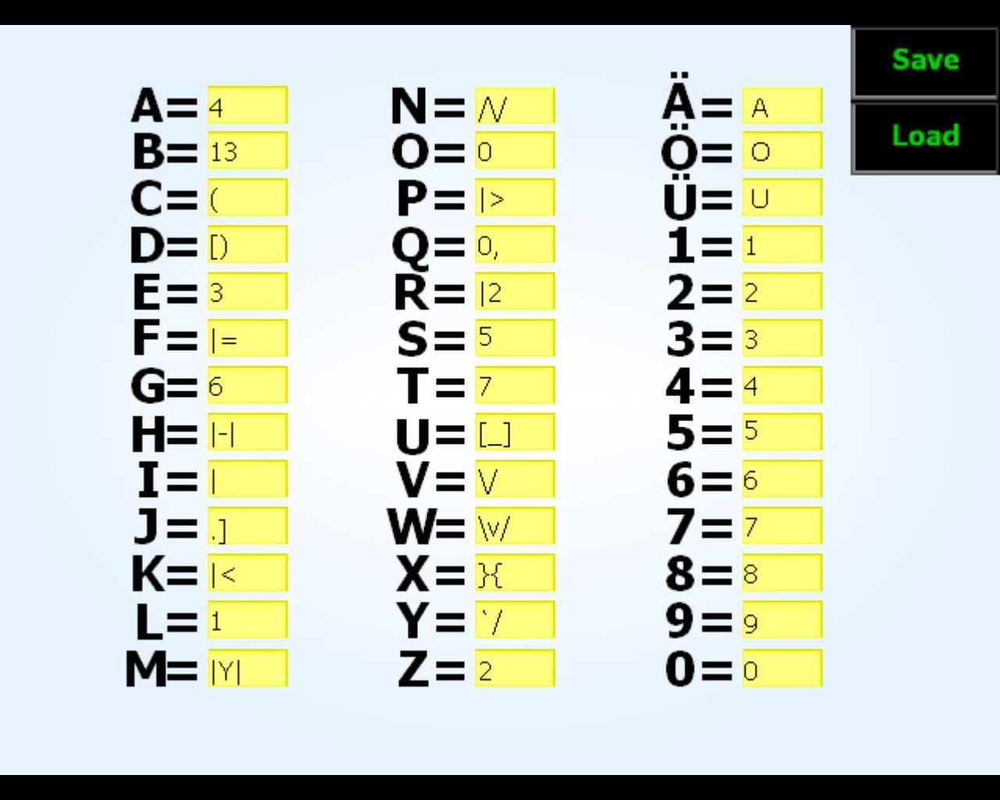

## LeetSpeak

  

Leetspeak, also known as 1337 or leet, is a form of written communication. It involves replacing letters with numbers, special characters, or other symbols.
## Live Demo

**[View the Website](https://be-akverse.github.io/LeetSpeak/)**

Making Fonts is not my thing but making websites is!

### How to install the font:
- **Windows:** Right-click `download` → "Install"
- **Mac:** Double-click `download` → "Install Font"
- **Linux:** Copy `download` to `~/.fonts/` or `~/.local/share/fonts/`

## Tech Stack

- [Calligraphr](https://www.calligraphr.com/)
- [Canva](https://www.canva.com/) 
- HTML/CSS/JS 

## Open Source

This project is licensed under the **MIT License** feel free to use the font in personal or commercial projects. Just don't blame me if your design looks like a toddler made it. That's the point.

